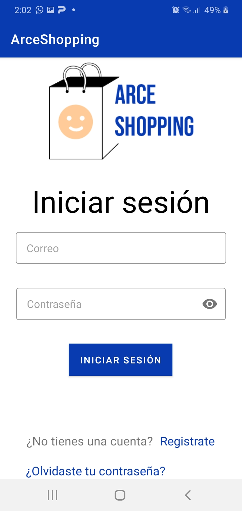
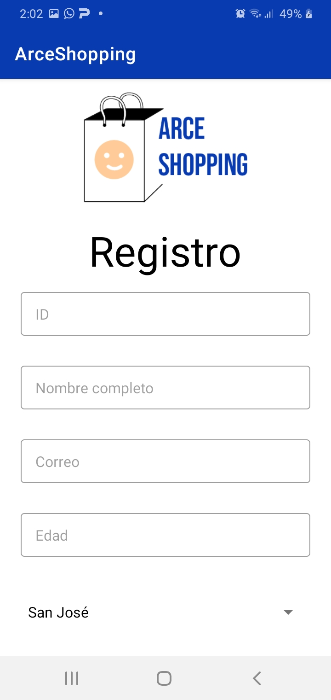
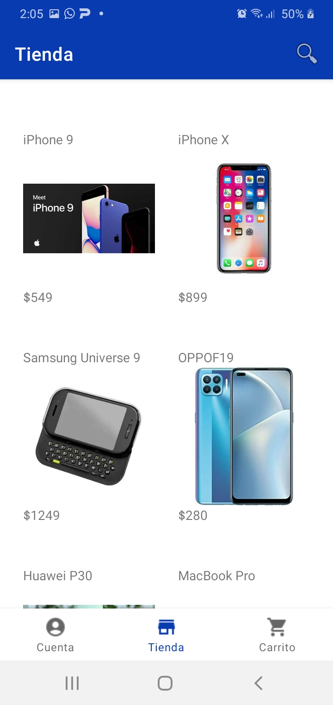
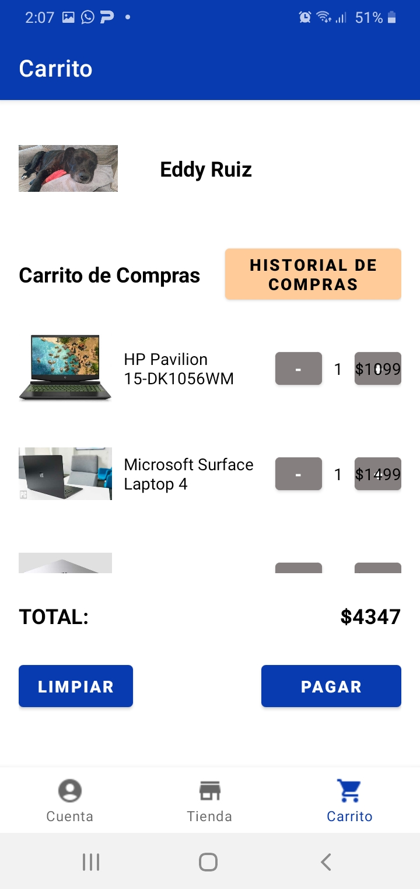
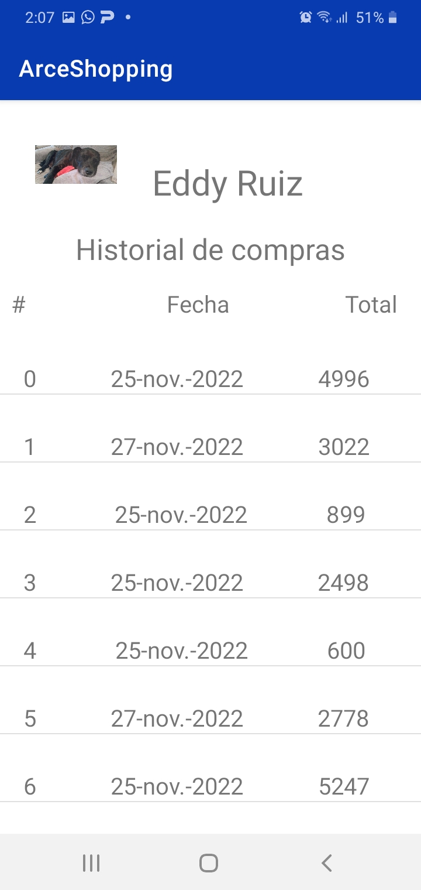
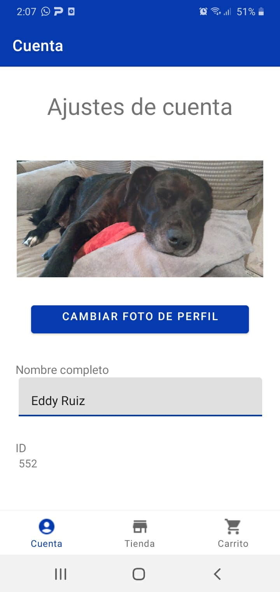

# ArceShopping
Este es el proyecto realizado durante el curso de Desarrollo de aplicaciones móviles en el segundo semestre 2022 de la Universidad de Costa Rica.

## Developers
- [Sol Valle](https://github.com/solvalle "Sol valle") 
- [Asdrúbal Villegas](https://github.com/asdru333 "Asdrúbal Villegas")
- Eddy Ruiz

## Tareas
En este proyecto, realizamos:
- Almacenamiento persistente mediante SQL Lite para el guardado de usuarios y compras durante las 2 primeras iteraciones. Luego, migramos a Firebase.
- Consumo de API por medio de Volley y Gson, de Google.
- Manejo de sesión de usuario por medio de FirebaseAuth.
- Creación y manipulación de elementos UI definidos en XML.
- Creación y uso de Fragments.
- Envio de e-mails.
- Recuperación de imágenes de la galería del dispositivo.
- Uso de la cámara del dispositivo.
- Carga de imágenes por medio de librería Picasso.
- Manejo de permisos de dispositivo como acceso a archivos del teléfono, ubicación del usuario, entre otros.
- Función de compartir compras por medio de redes sociales.

## Features
- Registro de usuarios e inicio de sesión de los mismos.
- Función de restaurar contraseña.
- Tab de usuario que permite cambiar datos como nombre, provincia de residencia y asignar una foto de perfil por medio de galería o cámara.
- Tab de tienda que permite al usuario incluir distintas cantidades de productos disponibles a su carrito de compras.
- Tab de carrito que permite al usuario confirmar su compra o bien, remover productos o incrementar el número de ellos en el carrito.  
- Pantalla de historial de compras, donde el usuario puede ver qué compras ha hecho, el detalle de cada una y compartirlas en redes sociales.

## Screenshots:

|

|

